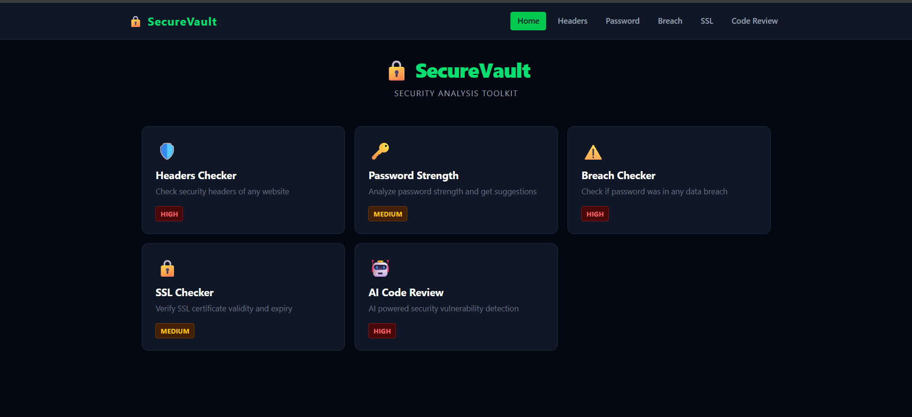
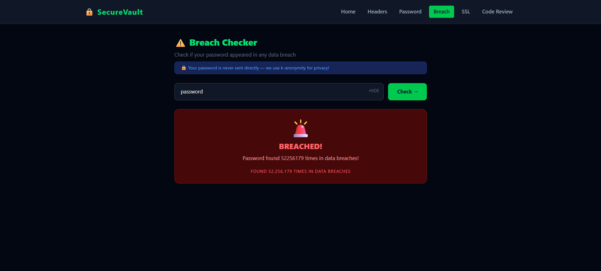
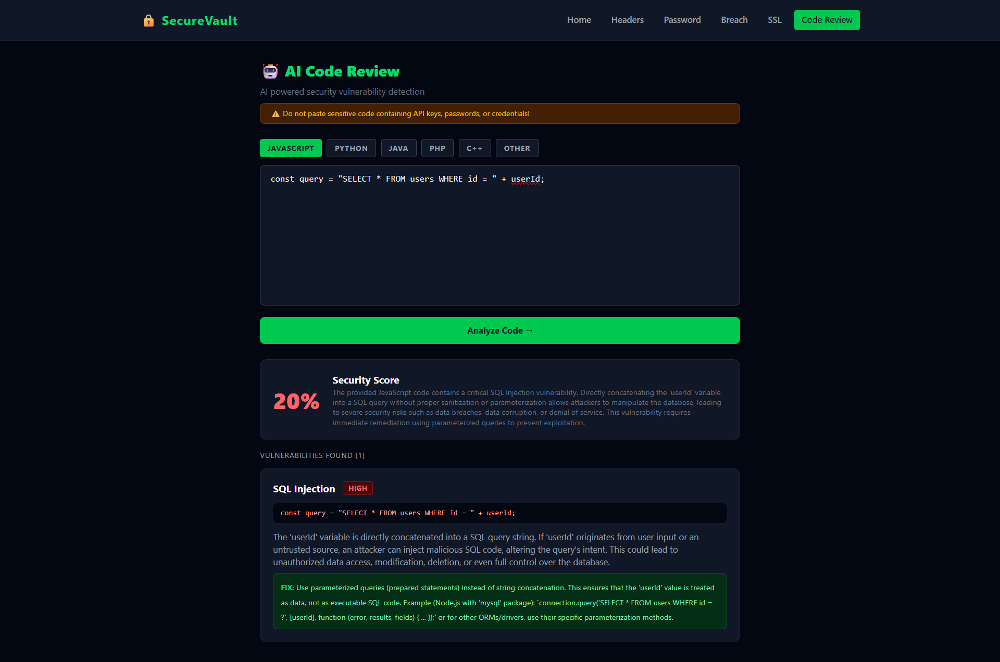

# 🔒 SecureVault

A security analysis toolkit built with Node.js and React.

## Features

- 🛡️ **Security Headers Checker** — Analyze HTTP security headers of any website and get a security grade
- 🔑 **Password Strength Checker** — Analyze password strength with detailed checks and suggestions
- ⚠️ **Breach Checker** — Check if a password appeared in any known data breach using k-anonymity
- 🔒 **SSL Checker** — Verify SSL certificate validity, expiry date and issuer details
- 🤖 **AI Code Review** — AI powered security vulnerability detection using Google Gemini

## Tech Stack

**Backend**
- Node.js
- Express.js
- Axios
- Express Rate Limit

**Frontend**
- React
- Vite
- Tailwind CSS
- React Router DOM

## Getting Started

### Prerequisites
- Node.js installed
- Gemini API Key — [Get here](https://aistudio.google.com)

### Backend Setup
```bash
cd backend
npm install
```

Create `.env` file:
```
GEMINI_API_KEY=your_gemini_api_key
PORT=5000
```

Run backend:
```bash
npm run dev
```

### Frontend Setup
```bash
cd frontend
npm install
npm run dev
```

## API Endpoints

| Method | Endpoint | Description |
|--------|----------|-------------|
| POST | `/api/security/check-headers` | Check security headers |
| POST | `/api/password/check-strength` | Check password strength |
| POST | `/api/breach/check-breach` | Check password breach |
| POST | `/api/ssl/check-ssl` | Check SSL certificate |
| POST | `/api/code/review` | AI security code review |

## Security

- Passwords are never stored or logged
- Breach check uses k-anonymity — password never leaves your system directly
- Input validation on both frontend and backend
- Rate limiting on all API endpoints

## Screenshots

### Home Page


### Password Breach Checker


### AI Code Review

